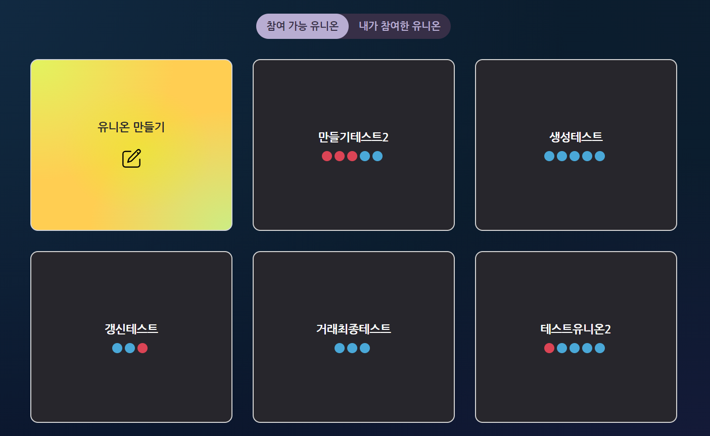
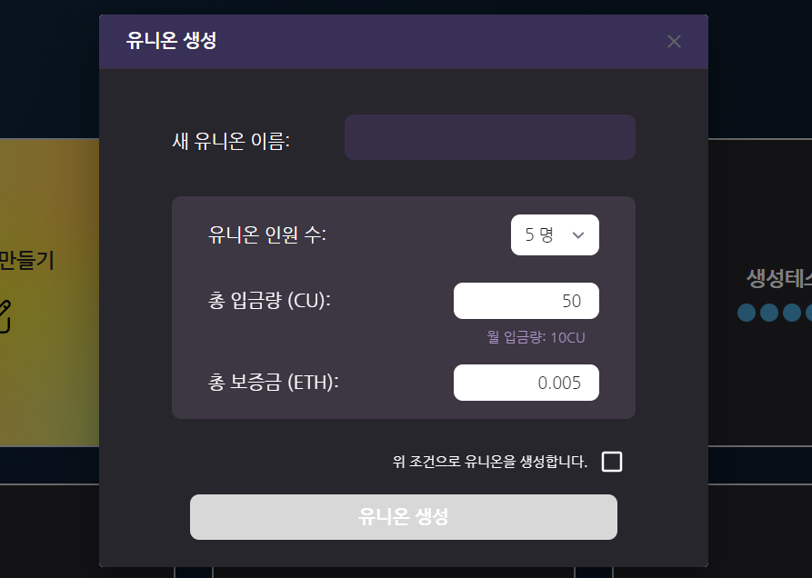
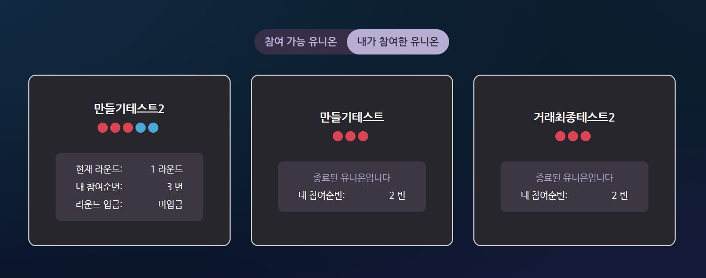

# 유니온 목록 및 생성


유니온은 Credit Union의 핵심 기능으로,\
CU token을 사용해 참여하실 수 있습니다.


## 1. 참여 가능 유니온 &#x20;

유니온 페이지에 들어가면, 위와 같은 화면을 볼 수 있습니다.\
기본화면은 '**참여 가능 유니온**'으로\
이 페이지에서 아직 시작하지 않은 유니온들을 확인하실 수 있습니다.\
위 화면에서 각 유니온 이름 밑의 빨간색, 파란색 동그라미는 각각 들어갈 수 없는 자리와 들어갈 수 있는 자리를 의미합니다.\
\
예를 들어 \[만들기테스트2]를 보면\
총 5round로 구성된 유니온으로 1,2,3 순번은 다른 사람이 들어가 있는 상태이며,\
4,5번은 참가가 가능한 상태입니다.

## 2. 유니온 생성  &#x20;

만약 마음에 드는 조건의 유니온이 존재하지 않는다면,\
**\[유니온 만들기]**를 통해 유니온을 생성하실 수 있습니다.\
\
유니온 이름과 유니온 인원 수, 총 입금량을 설정하고\
조건이 맞다면 유니온 생성 버튼을 누르시면 됩니다.\
각 조건의 세 사항은 다음과 같습니다.

* **새 유니온 이름**\
  유니온 이름은 유니온을 구분하는 ID값으로 사용됩니다.\
  따라 현재 참여가능한 유니온, 진행 중인 유니온과 동일한 이름으로 생성하실 수 없습니다.\
  만약 중복된 이름으로 유니온을 생성하고자 한다면 아래와 같은 경고창이 생성됩니다.\
  &#x20;                                          .png>)
* **유니온 인원 수** \
  유니온 인원은 현재 3, 5, 7, 9 명으로 구성이 가능합니다.\
  유니온은 유니온 인원과 동일한 라운드로 진행되며,\
  5명이라면 총 5개월간 진행되는 유니온이 만들어집니다.   \
  \
  &#x20;&#x20;
* **총 입금량**  \
  총 입금량은 자신의 차례에 받을 수 있는 CU token의 양과 동일합니다.  \
  5 라운드로 구성되고 총 입금량이 50 CU인 유니온에 3번째 순번에 참여했다라면,\
  매 라운드 당 입금해야 하는 CU의 양은 10 CU이며,\
  3 개월 차 (3round)에 50CU를 입금받을 수 있음을 의미합니다.  \
  &#x20; \

* **총 보증금**  \
  총 보증금은 총 입금량과 동일한 값어치의 ETH입니다.  \
  이 보증금은 처음 유니온에 참여할 때 빠져나가며, \
  매 라운드 입금 시, 월 입금량과 동일한 값의 ETH가 다시 계정에 반환됩니다. \
  &#x20;\
  만약 CU token 입금을 정해진 기간에 하지 못해 연체가 된다면,\
  보증금으로 제출한 ETH를 이용해 해당 round에 지급을 받는 계좌 CU token을 제공합니다.

## 3. 내가 참여한 유니온&#x20;

내가 참여한 유니온을 클릭하면 아래와 같은 화면이 나옵니다.

위와 같은 경우 해당 계정 **\[만들기테스트2], \[만들기테스트], \[거래최종테스트2]** 라는 유니온에 참여한 것을 확인할 수 있습니다.\
카드에는 간략한 정보가 적혀 있어 유니온 이용에 도움을 줍니다.\
\
예를 들어 \[만들기테스트2]의 경우,\
해당 계정은 3번 순번에 참여했으며 CU token을 입금하지 않은 상태이고,\
전원이 참여하지 않아 아직 시작되지 않았음을 알 수 있습니다.
