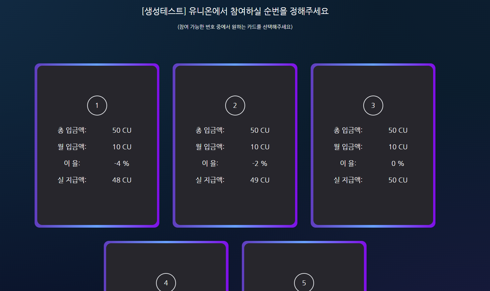

# 유니온

## 1. 유니온  참여 전 &#x20;

유니온 생성을 이용해 처음 유니온을 만들거나,  \
유니온에 참여했다가 모든 계정이 빠져나가 아무도 참여하지 않은 상태의 유니온에 들어간 경우,\
위와 같은 화면이 나오게 됩니다.  \
\
파란색 카드는 참여가 가능한 순번의 카드를 의미합니다.  \
카드의 세부 정보를 통해 실제 자신의 차례에 받을 수 있는 CU token의 양이 얼마나 되는지 알 수 있습니다. 급하게 Token이 필요한 경우 약간의 손실과 함께 앞의 순번을, 여유 있는 토큰이 많다면 뒷 순번을 선택하실 수 있습니다. \
위 카드 중에서 본인이 원하는 순번의 카드를 클릭하여 유니온에 참가하실 수 있습니다. &#x20;

### <mark style="color:blue;">이율</mark> &#x20;

총 입금액, 월 입금액, 실 지급액의 경우 [유니온 생성](undefined-1.md#2.)에서 설명된 내용과 동일합니다.  \
\
이율의 경우, **자신의 순번에 수령할 금액에 대한 이율**을 의미합니다.  \
앞 순번일수록 입금한 금액보다 적은 총액을 수령하며  \
뒷 순번일수록 입금한 금액보다 많은 총액을 수령하게 됩니다.  \
\
예를 들어 위 예시의 2번 카드를 보면,  \
총 입금액 50CU에 이율이 -2%이기 때문에 자신의 순번에 49CU를 받게 됩니다. &#x20;

## 2. 유니온 참여  후 &#x20;

유니온에 참여를 하게되면 화면이 위와 같이 변경됩니다.  \
카드 색상 정보, 수동 지급 받기, 유니온 나가기 버튼이 생성되는데 세부 정보는 다음과 같습니다. &#x20;

* **카드 생상 정보** \
  카드는 파란색, 빨간색, 분홍색, 노란색, 초록색이 존재하는데 각 색상 카드가 어떤 상태를 나타내는 지  \
  확인할 수 있는 창을 띄워줍니다.   \
  \
  **파란색** : 아직 참여하지 않은 순번  \
  **빨간색** : 다른 계정이 참여한 순번 ( round 미입금 상태 )  \
  **분홍색** : 다른 계정이 참여한 순번 ( round 입금 상태 )\
  **노란색** : 내가 참여한 순번 ( round 미입금 상태 )\
  **초록색** : 내가 참여한 순번 ( round 입금 상태 )  \
  \

* **수동 지급 받기**  \
  기본적으로 Credit Union은 마지막 사람이 입금기간에 입금을 완료하였을 경우 자동적으로 해당 순번의 계정에 Token이 입금되며, 다음 입금 기간이 갱신됩니다.  \
  \
  하지만 연체를 한 사람이 존재하여 자동으로 입금이 이루어지지 않았을 경우,  \
  수동 지급 받기 버튼을 통해 연체된 사람의 보증금(ETH)을 차감하여 CU token을 입금받으실 수 있습니다. 또한 이 수동 지급을 받은 시점부터 다시 round기간이 계산됩니다. &#x20;

* **유니온 나가기**\
  유니온에 참여를 했다가 생각이 바뀌어 해당 유니온에 참여를 하고 싶지 않아졌을 때, \
  유니온 나가기 버튼을 통해 해당 유니온에서 빠져나올 수 있습니다.  \
  참여만 한 경우, 참여를 하고 입금도 완료한 경우 모두 사용이 가능합니다.\
  다만 유니온이 시작되기 전에만 가능합니다. \

## 3. 입금 &#x20;

처음 라운드의 경우 입금기간이 따로 존재하지 않습니다.  \
내 유니온 카드를 클릭하면 입금을 하실 수 있으며, \
<mark style="color:blue;">**유니온에 참여한 후 바로 입금을 하시는 걸 추천드립니다**</mark>.  \
\
스왑에서와 마찬가지로 토큰을 입금하기 위해서는 해당 유니온에 대해 토큰 승인이 필요합니다.  \
입금버튼을 눌렀을 때 해당 유니온에 승인된 토큰 양보다 제출해야 하는 토큰의 양이 많은 경우 \
자동적으로 아래와 같은 모달 창이 생성되며 이 창을 통해 토큰 승인을 진행하실 수 있습니다  \
&#x20;                           \
&#x20;                                         \
&#x20;

모든 참여자가 입금을 마치고 다음 라운드가 실행되면 다음과 같이 변경됩니다. &#x20;

현재 라운드와 함께 입금 기간이 언제부터 언제까지인지 표기됩니다.  \
위 예시의 경우 <mark style="color:red;">테스트를 위해 각 라운드가 3분으로 설정</mark>되어 입금기간이 2분이지만 \
<mark style="color:blue;">**실 서비스의 경우 30일 기준으로 입금기간은 라운드 시작  29일에서 30일 사이**</mark>가 됩니다.
