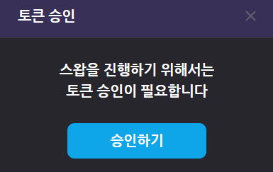

# 스왑


Credit Union의 토큰 스왑은 \
유니온에서 사용되는 **CU토큰을 이더리움과 교환 할 수 있는 기능**입니다.


&#x20;                                  \
\
스왑 기능은 ETH와 CU를 교환하는 기능입니다.\
1 ETH = 10000 CU이며\
최소 교환 단위는 이더리움의 경우 0.00000001 ETH,\
CU의 경우 0.0001 CU 입니다.

CU token을 ETH로 스왑하기 위해서는 Swap contract에 대해 token을 승인해주는 과정이 필요합니다.  \
스왑하기 버튼을 눌렀을 때 교환을 원하는 CU token의 양이 현재 contract에 승인된 token의 양보다 적을 경우 자동으로 아래와 같은 화면을 통해 토큰 승인 과정을 진행하실 수 있습니다.  \
승인이 끝난 후 다시 스왑하기 버튼을 통해 스왑 과정을 진행해주시면 됩니다.\
&#x20;                                      

&#x20;\
\
\
※ CU token 옆에 있는 지갑 아이콘을 클릭하면 Metamask의 지갑에 CU token을 추가할 수 있습니다.\
